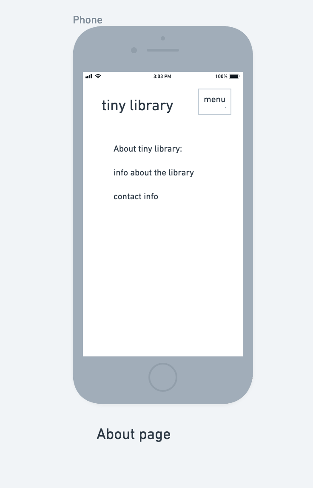
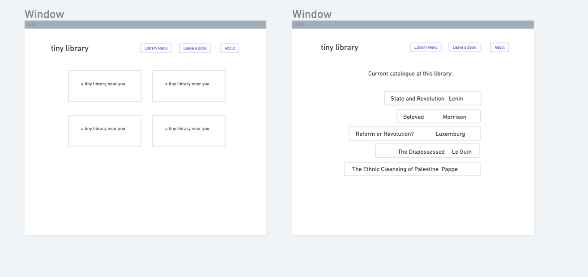
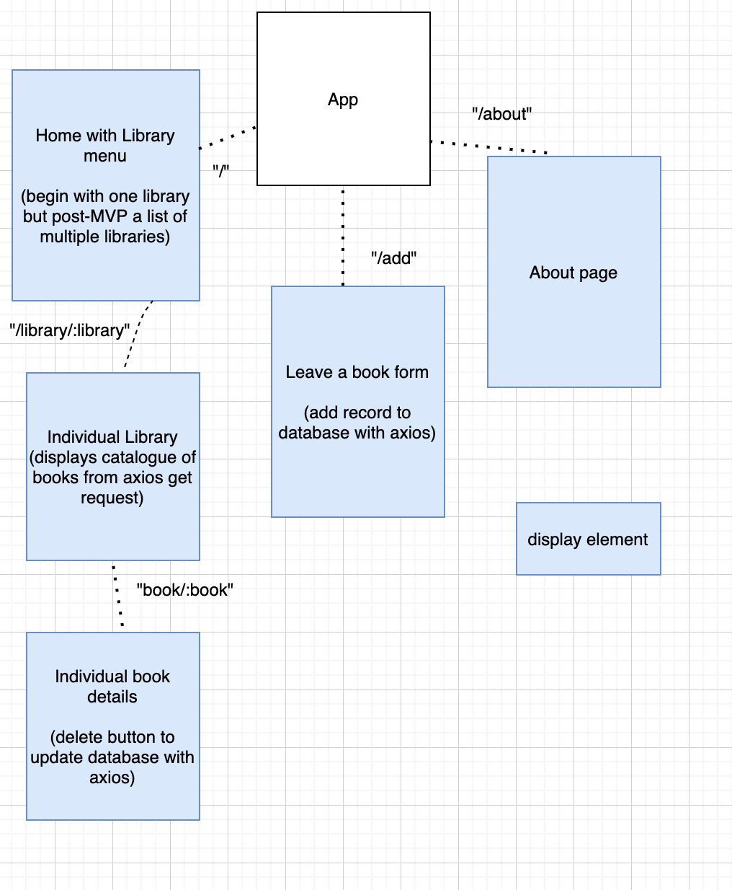

<!-- CODENAME: BANANA -->
# Project Overview

## Project Name

Tiny Library App
## Project Description

This app will create a catalogue for a Tiny Library where users can donate or take books. Using an Airtable API, the app will allow users to: 
- browse a catalogue of books in the Tiny Library
- add a record when they donate a book to the Tiny Library
- delete a record when they take a book from the Library
## Wireframes




## Component Hierarchy


## API and Data Sample
Sample json from Airtable database:

```json
{
    "records": [
        {
            "id": "recTabfp2VKpQwrqp",
            "fields": {
                "title": "The Communist Manifesto",
                "author-last": "Marx",
                "author-first": "Karl",
                "second-author-last": "Engels",
                "second-author-first": "Frederick",
                "recommendation": "the most important document of the 19th century"
            },
            "createdTime": "2021-06-28T22:35:24.000Z"
        },
        {
            "id": "rectcuYTabv20MdR0",
            "fields": {
                "title": "State and Revolution",
                "author-last": "Lenin",
                "author-first": "Vladimir",
                "recommendation": "bruh, if you want to overthrow the state, you better know what the state is first!"
            },
            "createdTime": "2021-06-28T22:35:24.000Z"
        },
        {
            "id": "recgGU2UUiJqWuWLz",
            "fields": {
                "title": "Social Reform or Revolution?",
                "author-last": "Luxemburg",
                "author-first": "Rosa",
                "recommendation": "reforming the current system? overthrowing it entirely? can we do both? still so relevant today"
            },
            "createdTime": "2021-06-28T22:35:24.000Z"
        }
    ],
    "offset": "recgGU2UUiJqWuWLz"
}
```

### MVP/PostMVP


#### MVP 
- use an axios get request to display a list of books in the Tiny Library from the Airtable API
- display a form for users to add a Title and Author for a book they are donating and a field for a short review or recommendation
- provide a delete button for each book so that users can delete the record in the Airtable database with axios when they take a book from the Library

#### PostMVP  
- allow users to select from multiple Tiny Libraries and view catalogue information for each Library
- display multiple Tiny Libraries on a map
- use another API to fill in additional information about books in the catalogue and potentially to correct spelling or other errors in user-generated data
- add a feature that allows user to search through multiple Tiny Library catalogues by author, title, and other criteria such as genre or review keywords


## Project Schedule


|  Day | Deliverable | Status
|---|---| ---|
|June 28| Prepare project pitch and Readme; Set up Airtable Database | Complete
|June 29| Project Approval; pseudo-code and begin coding basic structure | Incomplete
|June 30-July 1| Complete code and debugging; CSS styling  | Incomplete
|July 2| Moring: finish CSS tweaks; Deploy by 12:30 | Incomplete
|July 7| Presentation  | Incomplete


## Timeframes

| Task | Priority | Estimated Time | Time Invested | Actual Time |
| --- | :---: |  :---: | :---: | :---: |
| Pseudocoding & coding basic app | H | 3hrs| |  |
| Basic CSS | H | 1 hr|  |  |
| Debugging | H | 2 hrs|  |  |
| More refined CSS | M | 2.5 hrs|  |  |
| Adding Map feature (post-MVP) | M | 3 hrs|  |  |
| Researching a 2nd API (post-MVP) | L | 1 hr|  |  |
| Adding 2nd API for additional information and search feature (post-MVP) | L | 3 hrs |  |  |
| Total |  | 15.5 hrs|  |  |

## SWOT Analysis

### Strengths:


### Weaknesses:

### Opportunities:

### Threats: